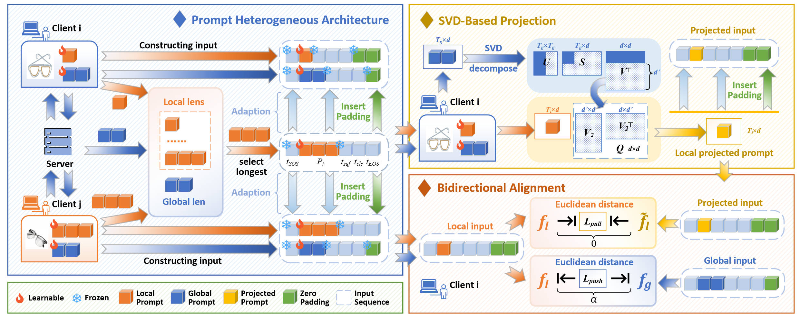








# Short Bio

Hi there! This is Chengying Fang (方程瑛), I am a first-year graduate student at [School of Computer Science at Wuhan University](https://cs.whu.edu.cn/), advised by Prof. [Mang Ye](https://scholar.google.com/citations?user=j-HxRy0AAAAJ&hl=zh-CN). If you are interested in collaborating with me or want to have a chat, always feel free to contact me through e-mail！

My research mainly focuses on **Federated Learning** and **Large Language Model**.

# 🔥 News

<ul>
  <li><em>2025.05:</em> 🌟 FedPHA was accepted to <strong>ICML 2025</strong>.</li>
</ul>

# 📝 Publications 

&dagger;: equal contribution, * : corresponding author

<dl>
  <dt></dt>
  <dd><a class="publication-title">FedPHA: Federated Prompt Learning for Heterogeneous Client Adaptation</a></dd>
  <dd><strong>Chengying Fang&dagger;</strong>, Wenke Huang&dagger;, Guancheng Wan&dagger;, Yihao Yang, Mang Ye*</dd>
  <dd>International Conference on Machine Learning  <strong>(ICML)</strong>, 2025</dd>
  <dd>
    <a href="https://openreview.net/forum?id=y7pDvbi9xz" target="_blank">📄 Paper</a> |
    <a href="https://github.com/CYFang6/FedPHA" target="_blank">💻 Code</a>
  </dd>
</dl>

# 📖 Educations

- *2024.09 - now*, Master Student, School of National Cybersecurity, Wuhan University, China.
- *2020.09 - 2024.06*, Bachelor, School of National Cybersecurity, Wuhan University, China.
